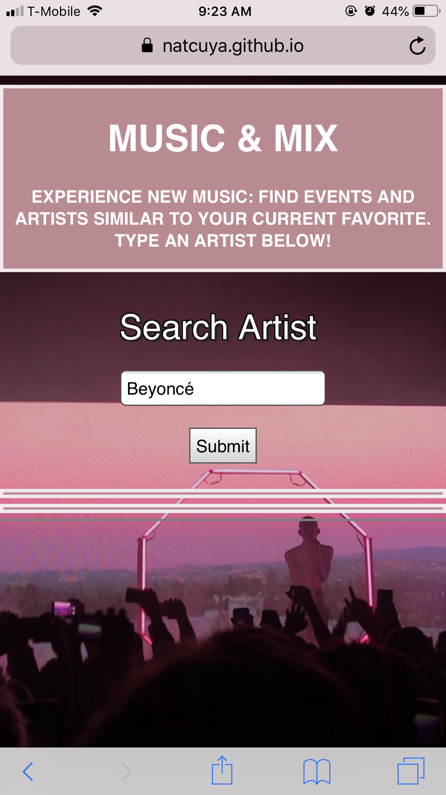
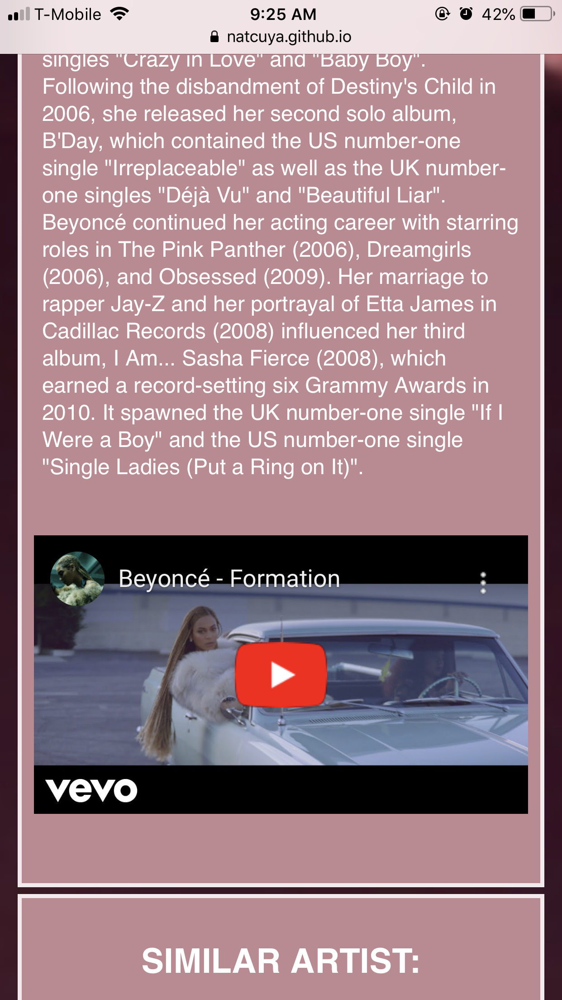

Application Name: Music & Mix Web App

Purpose:
The purpose of this application is to connect the user to upcoming music events/attractions while simultaneously presenting suggested artists/bands the user may also enjoy. 
The goal is to connect the user to new music experiences. This is achieved by using two popular APIs: TicketMaster and TastDive. 

Summary:
The user is prompted to type in their favorite artist into the search bar. By doing so the user will be linked to a description of the artist as well as a youtube video. A list of three similar artists will appear below that description. Each suggested artist result will have a description and a youtube video attached. simultaneously, the application will present events and attractions related to the searched artist. The event results will include a photo of the artist or event, the number of upcoming events, and a link to the Ticketmaster webpage where the user may purchase tickets. 

Key Technologies Used: Front End

1. HTML 

2. CSS

3. JavaScript

4. jQuery

Initial page: 

Page when item is searched: Artist Info

Similar Artist Section:

Events Listed under key search: 

APIs used: 

TicketMaster
TasteDive

Features: 

Creates a summary of the searched artist entered

Presents a list of new artists/bands similar to the searched artist

Presents a list of events associated with the searched artist

Mobile Friendly 

Demo:
https://natcuya.github.io/music_mix/
